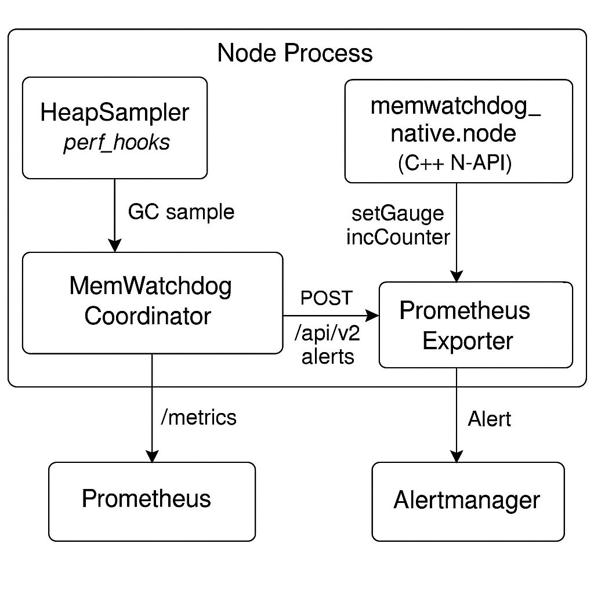

# MemWatchdog Architecture – How the Node-JS Leak Detector Works

- **Purpose** Detect memory‑leaks in long‑running Node.js services **without** profiler  
- overhead and surface actionable data through Prometheus, Alertmanager and a CLI.

---

## High‑level component map



| Legend                 | Description                                                                                                                         |
| ---------------------- | ----------------------------------------------------------------------------------------------------------------------------------- |
| **HeapSampler**        | Zero‑overhead JS sampler: listens to `'gc'` events, stores `heapUsed` window.                                                       |
| **native addon**       | C++ timer every *N* ms collects `used_heap_size`, computes slope; on threshold breach dumps `.heapsnapshot` and calls back into JS. |
| **Coordinator**        | Glue layer (`MemWatchdog`): updates metrics, fires leak events, pushes Alertmanager alerts.                                         |
| **Exporter**           | Tiny HTTP server (`/metrics`) exposing gauges/counters for Prometheus scraping.                                                     |
| **AlertManagerClient** | Best‑effort POST to Alertmanager; retries with back‑off + jitter.                                                                   |


## Data‑flow (leak detection path)

1. Sampling
   - V8 GC finishes ⇒ `perf_hooks` emits `gc` entry.
   - `HeapSampler` records `{ ts, heapUsed }` into a circular buffer (default 30).

2. Slope computation
   - Independent libuv timer in C++ queries `Isolate→GetHeapStatistics()` every `interval` (default 60 s).
   - Linear‑regression over last `window` samples → slope `bytes/ms`.

3. Threshold breach
   - If `slope ≥ threshold` (default = 1024 B/ms) → 
        - Capture heap‑snapshot via `v8::HeapProfiler::TakeHeapSnapshot()` → write `heap‑<epoch>.heapsnapshot`.
        - Invoke TSFN to JS with `(slope, snapshotPath)`.

4. Coordinator
   - Emits `'leak'` event & optional user callback.
   - Increments `memwatchdog_leak_alert_total` + sets latest `memwatchdog_heap_slope_bytes_per_ms` gauge.
   - Fires Alertmanager POST in background.
5. Observability
   - Prometheus scrapes `/metrics`; Alertmanager routes `MemLeakDetected` alerts to pager/Slack.


## Package layout

| Package / Dir             | Purpose                                                                                   |
| ------------------------- | ----------------------------------------------------------------------------------------- |
| **`packages/core`**       | Runtime SDK embedding memwatchdog into any Node service.                                  |
| **`packages/cli`**        | Dev‑tooling: diff & visualise `.heapsnapshot` pairs (`mw analyze`).                       |
| **`packages/pm2-plugin`** | Auto‑injects watchdog into pm2/nodemon managed processes.                                 |
| **`native`**              | N‑API addon (C++17, header‑only `snapshot.hpp`). Prebuilt with `scripts/build-addons.sh`. |
| **`scripts`**             | Shell/Node helpers: build addons, post‑install fetch/build, etc.                          |
| **`docs`**                | This document + Prometheus guide + CLI manual.                                            |
| **`examples`**            | Minimal service demonstrating integration & alert flow.                                   |
| **`benchmarks`**          | Micro‑benchmarks proving near‑zero overhead of sampler.                                   |

> Mono‑repo managed by pnpm workspaces + Lerna; all packages share a single version (`0.x.y`).

## Prometheus metrics

| Metric                                | Type    | Description                                     |
| ------------------------------------- | ------- | ----------------------------------------------- |
| `memwatchdog_heap_used_bytes`         | Gauge   | Last observed `process.memoryUsage().heapUsed`. |
| `memwatchdog_heap_slope_bytes_per_ms` | Gauge   | Current linear‑regression slope (bytes/ms).     |
| `memwatchdog_leak_alert_total`        | Counter | Number of threshold breaches (alerts fired).    |

> Metric names accept optional `prefix` (e.g., `myapp_`) set in exporter options.

<br/>

## Alertmanager template

```yaml
- alert: MemLeakDetected
  expr:  memwatchdog_heap_slope_bytes_per_ms > 1024
  for:   10m
  labels:
    severity: critical
  annotations:
    summary:  "Heap is growing rapidly ({{ $value | humanize }} B/ms)"
    runbook:  https://github.com/Voskan/memwatchdog/wiki/Heap-Leak-Runbook
```

When the native addon breaches the slope, it proactively POSTs, but having a
Prometheus rule as well provides redundancy if TSFN fails or the process
crashes before sending.

<br/>

## Build & release pipeline

1. **CI matrix** builds native addon for Linux glibc/musl, macOS, Windows (x64+arm64) → uploads artefacts.

2. Tag `vX.Y.Z` → release job pulls artefacts, packages `@memwatchdog/*`, `npm publish`.

3. Post‑install script fetches correct prebuilt or compiles from source on exotic platforms.

<br/>

### Extensibility roadmap

| Milestone              | Notes                                                                      |
| ---------------------- | -------------------------------------------------------------------------- |
| **JIT leak detection** | Online adaptive threshold (statistical anomaly detection).                 |
| **Grafana dashboard**  | JSON provisioned board with slope trend, alert count, heap‑used sparkline. |
| **k8s Sidecar**        | Distroless image exporting metrics & alerts for any Pod (no code change).  |
| **VS Code extension**  | Integrated `mw analyze` results viewer + “Open snapshot in DevTools” link. |
| **Plugin API**         | Allow custom snapshot post‑processors (e.g., auto‑upload to S3).           |


<br/>

## Security considerations

- Heap‑snapshots may contain **object values & secrets** ⇒ store under `/var/tmp`,
`0600` perms, optionally gzip & encrypt before off‑box transfer.

- Native addon uses only public **N‑API**; no direct V8 pointers exposed to JS.

- Alert payloads limited to slope & file‑path (never snapshot content).


## FAQ

| Question                      | Answer                                                                                             |
| ----------------------------- | -------------------------------------------------------------------------------------------------- |
| **Overhead?**                 |  \~ 2 % CPU on synthetic micro‑benchmark; negligible in production workloads (<1 µs / sample).     |
| **Node version support?**     | Node 18 LTS + (N‑API v8).                                                                          |
| **Cluster/worker threads?**   | One watchdog per **process**. Under `cluster`, enable exporter only in master to avoid port clash. |
| **Can I disable Prometheus?** |  Yes: `prometheus: false` in `MemWatchdog.start()`.                                                |


<br/>

Happy leak‑hunting 🚀


---

<details>
<summary>License & Attribution</summary>

> © 2025 Voskan Labs, Inc. &nbsp; <https://voskanlabs.com>  
> License: MIT  
> Author: **Voskan Voskanyan** &lt;voskan1989@gmail.com>  
> Last updated: 2023-10-01  
> This document is part of the **MemWatchdog** project
</details>